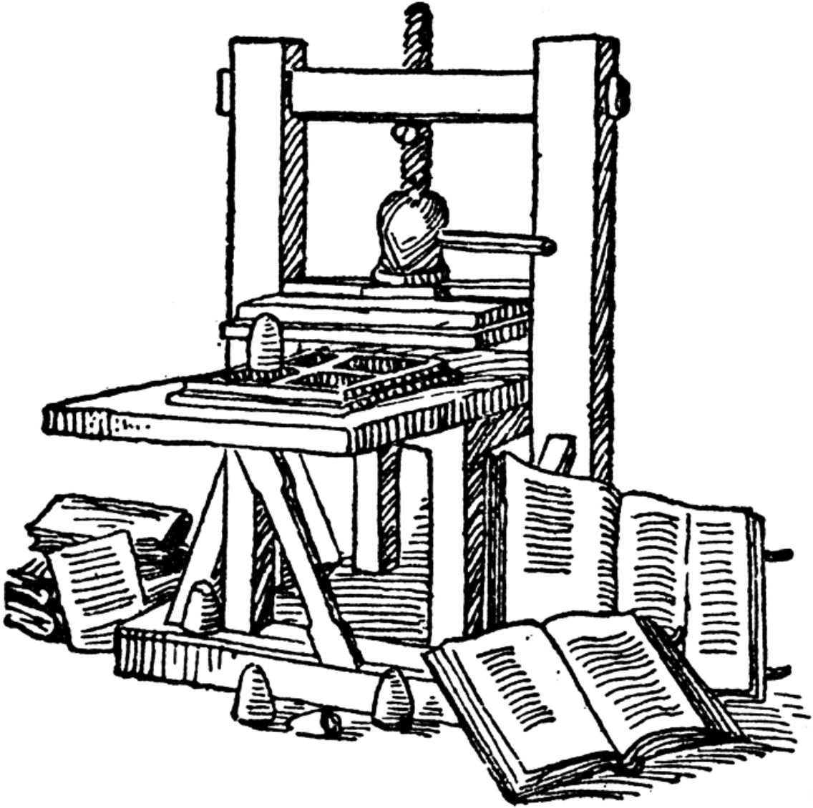

# Intro to Database Architecture

## The first writers

In 2012, I gave [a talk at TEDxUChicago](https://www.youtube.com/watch?v=rtl9QG4qe6g), in which I discussed the following idea:

When the printing press was invented, the foundation of the world was the written word.

The foundation of the world _today_ is software.

I want to extend the analogy a bit more...

Back in the early times, what were people writing? On this tablet, is the _very first_ name in recorded history (the author's signature):

Do you know what is written here? Try to guess, then click for the answer:

<button type="button" class="btn btn-primary" data-bs-toggle="modal" data-bs-target="#firstWrittenName">
  Answer
</button>

  

    

      

        "29,086 measures barley; 37 months — Kushim"
      

      

        <button type="button" class="btn btn-secondary" data-bs-dismiss="modal">Close</button>
      

    

  

> "It is telling that the first recorded name in history belongs to an accountant, rather than a prophet, a poet, or a great conqueror."
> — Yuval Noah Harari, Sapiens: A Brief History of Humankind
