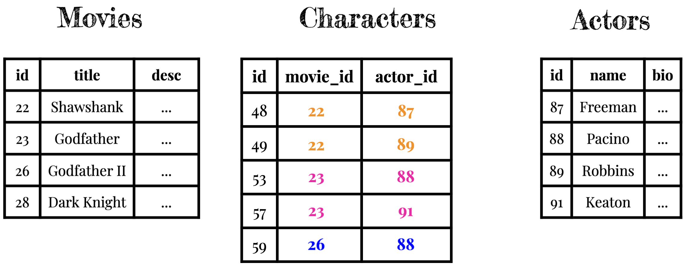

# Intro to Database Architecture

## The first writers

In 2012, I gave [a talk at TEDxUChicago](https://www.youtube.com/watch?v=rtl9QG4qe6g), in which I discussed the following idea:

When the printing press was invented, the foundation of the world was the written word.

The foundation of the world _today_ is software.

I want to extend the analogy a bit more...

### What were they writing?

Back in the early times, what were people writing? On this tablet, is the _very first_ name in recorded history (the author's signature):

Do you know what is written here? Try to guess before you click.

<button type="button" class="btn btn-primary" data-bs-toggle="modal" data-bs-target="#firstWrittenName">
  Click for answer
</button>

  

"29,086 measures barley; 37 months — Kushim"
  

- Who was "Kushim"? What do you think their job was? Give it a guess!
{: .free_text #first_job title="The first recorded job" points="1" answer="any" }

---

### What were they printing?

> "It is telling that the first recorded name in history belongs to an accountant, rather than a prophet, a poet, or a great conqueror."
> — Yuval Noah Harari, Sapiens: A Brief History of Humankind

After the bible, what was the best-selling book in the 17th century? Try to guess before you click.

<button type="button" class="btn btn-primary" data-bs-toggle="modal" data-bs-target="#earlyBestSeller">
  Click for answer
</button>

  

    Almanacs!
  

---

An almanac is an annual publication that includes information such as weather forecasts, farmers' planting dates, tide tables, and tabular information often arranged according to the calendar.

### My Claim

The killer application of writing, and printing, was _recordkeeping_.

The killer application of computing _is also_ recordkeeping.

The heart of the ultra-valuable cloud-based apps that have "eaten the world" is the information they are keeping track of. Users, tweets, and who-follows-who in Twitter. Listings, bookings, and messages in Airbnb. Venues, reviews, and ratings in Yelp. Etc.

We keep track of this information as records in plain old tables — just like they did in almanacs in the 17th century. One of the most important parts of developing an app to solve a problem is figuring out _what information it needs to keep track of_. And then, designing a set of tables to organize that information effectively. This is part of the process known as _database architecture_.

Database architecture is part of a larger process known as _domain modeling_, wherein a developer becomes a mini-domain-expert in the area they're building software for.

Domain modeling involves conducting interviews, reading reference manuals and textbooks, discovering existing processes, gathering sample data, making mockups, and other research.

Only after you've done this research can you begin to implement a solution. We'll focus on the database architecture part of domain modeling, for now.

## Request/Response Cycle

{: .bleed-full }

It is, of course, important to provide a usable interface; but the interface by itself is not useful without the information.

<aside>
For most cloud-based software. If you're writing a non-cloud based game, then the interface itself may indeed be the valuable part.
</aside>

The core value of cloud-based apps is the ever-changing information it keeps track of.

airbedandbreakfast.com, circa 2009:

We've only scratched the surface of HTML and CSS, but it's enough for our purposes for now.

Today we're going to start learning how to store and retrieve users' information — ultimately, the value of most cloud-based apps.

## Databases

A "database" is a piece of software that stores and retrieves information. We'll be using a type of database known as a _relational database_, or RDBMS (relational database management system).

Relational databases are the workhorses of computing. There are other kinds of databases for specialized purposes (graph databases, vector databases, etc); but relational databases drive the main functionality of most cloud-based software.

Don't let the fancy name throw you — relational databases are a set of tables — like an almanac. Each table has headings and entries, or columns and rows; and we perform lookups to find information that we want. I don't want you to think about databases as software at all. Try to think of them as just paper, like almanacs or clipboards.

We have to be able to describe the routine we would go through to do these lookups manually, as humans, if we had the tables printed out on paper. Computers are faster at doing them than us, but computers can only do the same, simple operations that we can — filtering based on criteria, sorting, counting, and cross-referencing rows in tables.

## One strategy for database architecture

- **We** (the developers) figure out the main _things_, or _nouns_, in our problem space while domain modeling. These things are candidates to be **tables**.
- For each thing, we figure out which _attributes_ we need to keep track of. These attributes are candidates to be columns in that table.
- We (the developers) create the tables and columns we identified.

In a relational database, all user actions translate to creating, reading, updating, or deleting **rows** in the tables that the developers have created.

We say "create, read, update, or delete" so often — the fundamental 4 operations that all user actions map to — that, in the industry, we abbreviate it to **CRUD**.

Note: Users cannot create tables, or add columns to tables. They can only CRUD **rows** in existing tables.

## Database design constraints

### Constraint one

Users actions can CRUD rows within existing tables, but **cannot add new tables or columns**. 

We, the developers, will create all tables and columns up front, when we design and deploy the application.

User actions can CRUD a million **rows** per second. But they can't add _any_ tables or columns.

### Constraint two

**We can only store one value per cell.**

It's tempting sometimes to want to store multiple values within one cell, perhaps separated by commas or slashes — but it makes filtering hard.

The value in one cell can be a very long piece of text, like a bio; but it can't be _multiple_ bios for different people.

## Must See Movies

Okay, this is all pretty abstract. Let's look at some examples.

Lets examine [this application](https://msm-associations.matchthetarget.com/), which is one that we'll build in class. It's a very simplified version of the iMDB Top 250 movies list (this is where we scraped the data from).

Click around it for a minute and then try to imagine — what are the tables and columns powering this application? How many tables are required? What columns are in each table? I'll show you a solution in a moment, but take a guess.

Remember:

- **We** (the developers) figure out the main _things_, or _nouns_, in our problem space while domain modeling. These things are candidates to be **tables**.
- For each thing, we figure out which _attributes_ we need to keep track of. These attributes are candidates to be columns in that table.
- We (the developers) create the tables and columns we identified.

### One big table: Movies

"Movie" seems like an important noun in this app's problem domain. Let's make a table to keep track of movies. To guide us in identifying the attributes that are being stored, let's look at [a movie's details page](https://msm-associations.matchthetarget.com/movies/24).

We add columns for all of the attributes of a movie (title, duration, description, etc — there's not enough room on the slide for them all but pretend they are there).

The "id" column is automatically added to every table, and the db assigns a unique value for each record. We don't get to pick the name of the column or assign values.

Now imagine that we start adding columns for the director info that we see on the movie details page, like the director's name. But there is also more information about each director [on their own details page](https://msm-associations.matchthetarget.com/directors/2662) — where should we store that information?

We could continue storing more and more director attributes (like bio or dob) within movies, but we will start to get a lot of redundancy But, it works and doesn't violate either of our two db design constraints.

Now imagine that we start adding columns to keep track of the actors who star in a movie. We run into a problem: we've violated Constraint Two — we can't store more than one value in a single cell.

One reason for not adding multiple values in a single cell — when the values are long there will be a lot of redundancy. More importantly, filtering rows by a criteria is a lot easier when you don't have to look through a list.

### More than one table

So: if we only have one table, we'll have to break Constraint Two. Let's try multiple tables instead. What are other important nouns in the problem domain that might deserve their own table?

Wherever we observed redundancy, or if we were tempted to store more than 1 value in a cell, that's a candidate for an entity that requires its own table.

#### One-to-many relationships

As we build it out we will find that we need some **one-to-many relationships** between tables. This will make use of _primary keys_ and _foreign keys_ to associate rows to one another.

#### Many-to-many relationships

And we will also find that we need some **many-to-many relationships** between tables. This will require us to put two primary keys in a new _join table_.

And we may will also find that there are real names to describe the relationships in such many-to-many join tables!

### Must See Movies Solution

The full database architecture solution to [Must See Movies](https://msm-associations.matchthetarget.com/) can be found below. Try not to peek at the solution until you've tried to write it out yourself by hand or in a spreadsheet software.

[**Solution PDF file**](https://res.cloudinary.com/dmxgp9oq2/image/upload/v1708589795/appdev-lessons/intro-to-database-architecture/main/Must%20See%20Movies%20database%20architecture%20solution.pdf)

